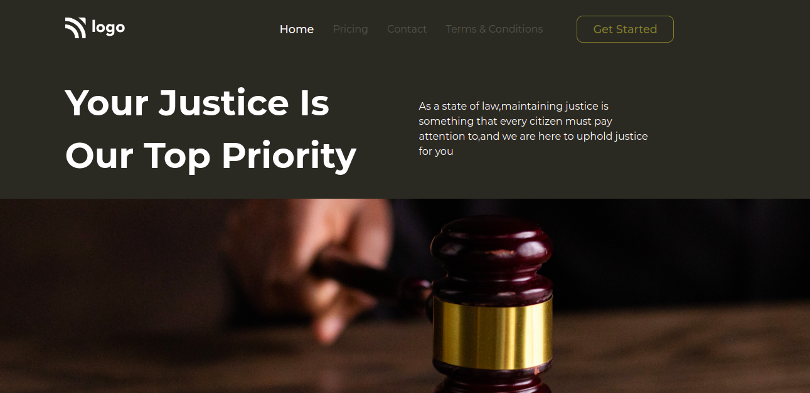

# law Home Page

- This is my **third** project made with HTML and CSS. It took me 2-3hrs to make this page.There is no such major difficulty that I faced in making this project but I learned a lot of little bit things while making this project as a beginner.

- The live link of this project is given below:

---

## Screenshot

---

## 🛠 Skills learned

HTML, CSS

---

## 🚀 About Me

### Hey, I am Yasir lambawala

- I am born and brought up in Vadodara, Gujarat. I have done my Btech at GTU university and I am currently learning Web-development.

---

## Feedback

- If you have any feedback, please reach me at lambawalay@gmail.com
